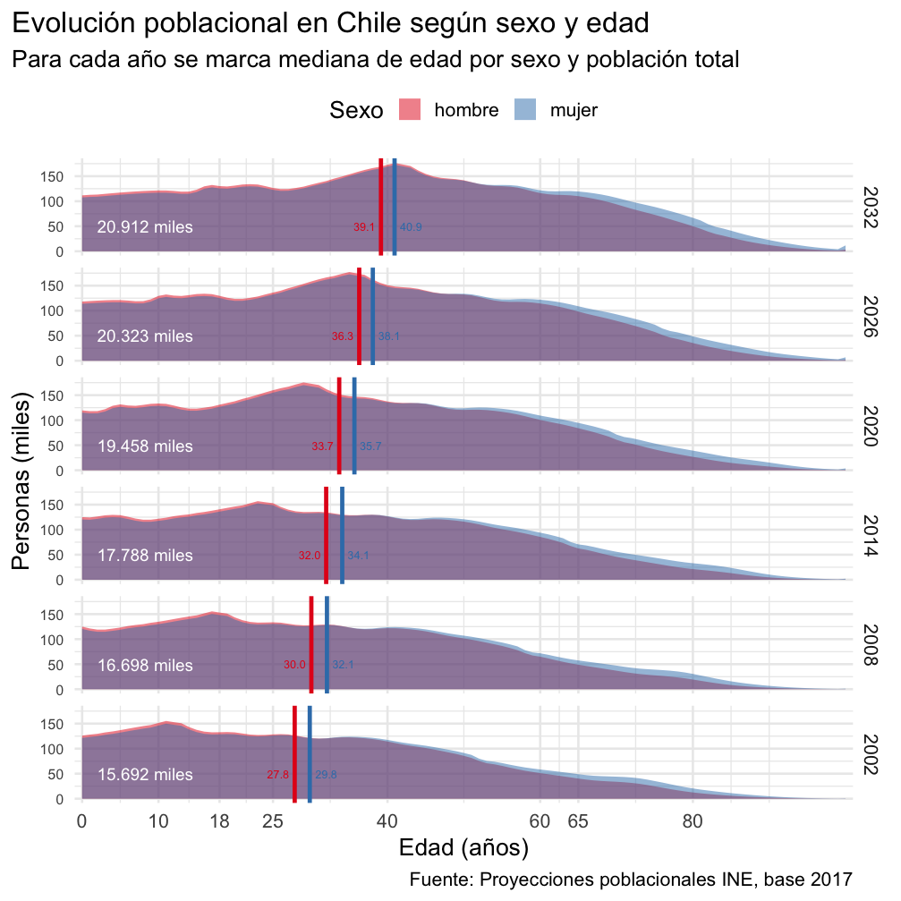
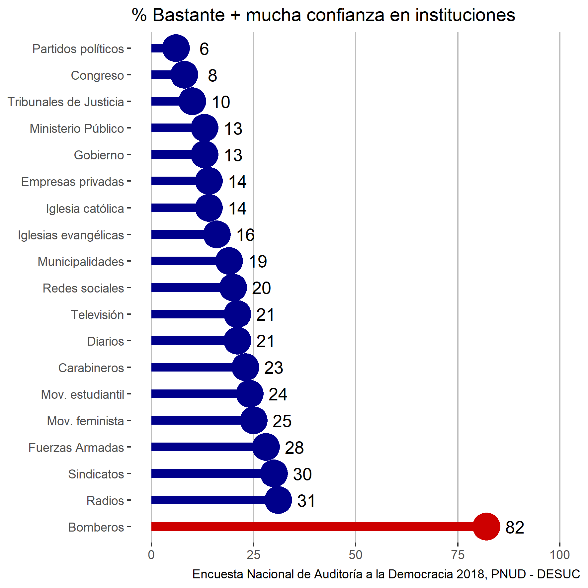
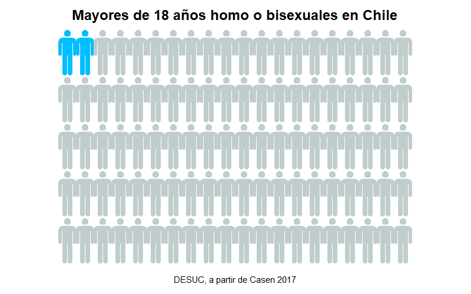
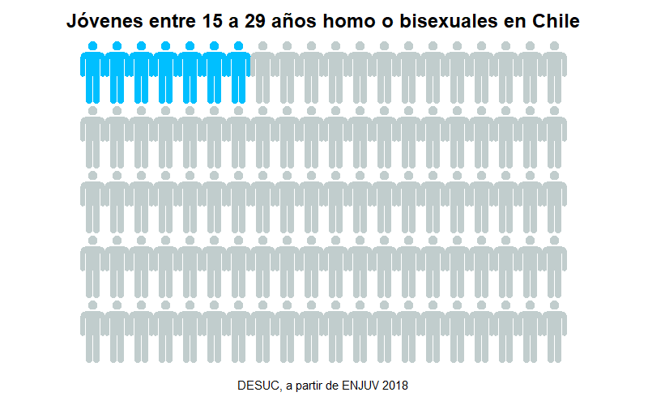
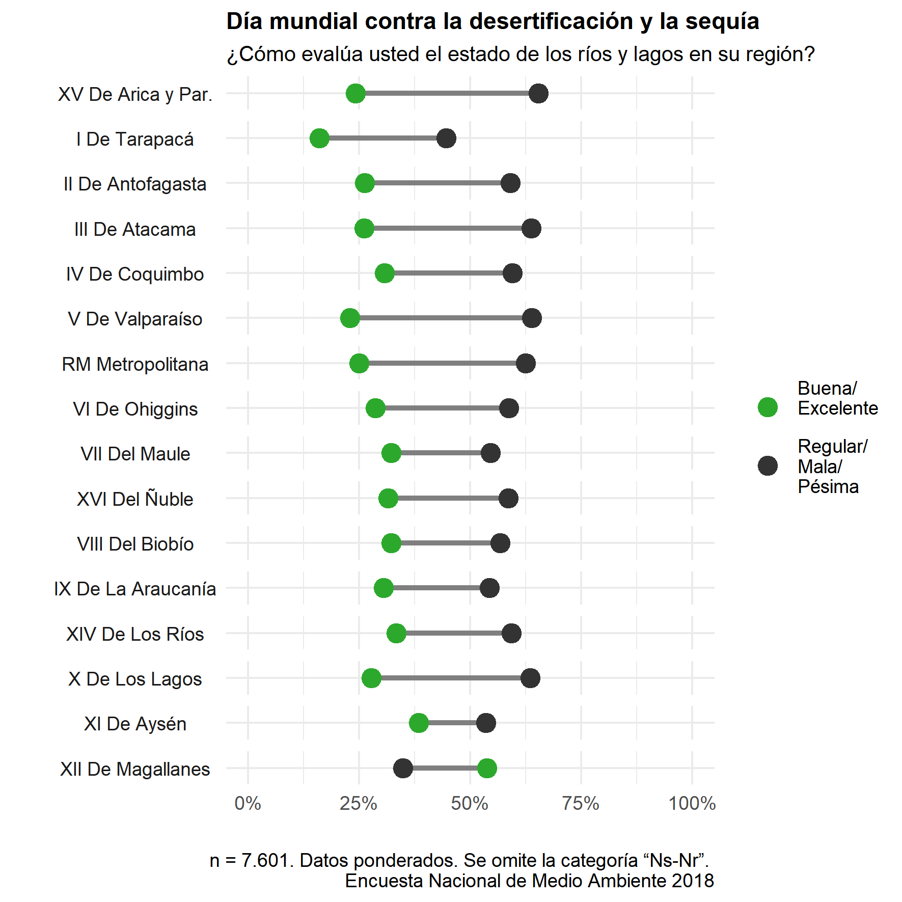

<!-- README.md is generated from README.Rmd. Please edit that file -->


```{r, echo = FALSE}
knitr::opts_chunk$set(
  collapse = TRUE,
  comment = "#>",
  fig.path = "man/figures/README-"
)
```

Códigos de gráficos y visualizaciones que se suben a las redes sociales de DESUC.

## 11 juli 2020: World Population Day

- Código disponible [aquí](R/200711-dia_poblacion_mundial.R)

  


## 30 junio 2020: Día del Bombero

- Código disponible [aquí](/R/200630-dia_bombero.R)

  


## 28 junio 2020: Orgullo Gay 

- Código disponible [aquí](/R/200628-dia_orgullo_gay.R)

  

  


## 17 junio 2020: Dia Mundial contra la desertificación y la sequía

- Código disponible [aquí](/R/200617-dia_mundial_sequia.R)

  
